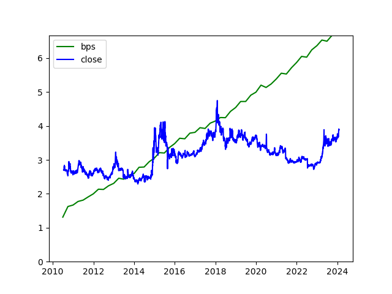

# QuantScripts

这里放了一些日常的可公开的量化交易日常脚本.

# 计算股指贴水

这是一个用tushare数据计算股指贴水的脚本:
```
calculate_premium.py
```
# 添加外部曲线

从图片中获取“也谈FOF”公众号的CTA指数等净值曲线的脚本:
```
extract_data.py
```
# 计算银行市净率的脚本。

有人和我说银行破净是常态，我有点怀疑，记得十多年前刚开始炒股的时候不是的。为了确认自己是不是记错了，就写了这个脚本看看“农业银行”的情况。

```
bank_bps.py
```
<!-- 插入图片 bank_bps.png -->


具体银行股怎么定价，看起来是个复杂的问题，后续我就没有深入研究了。